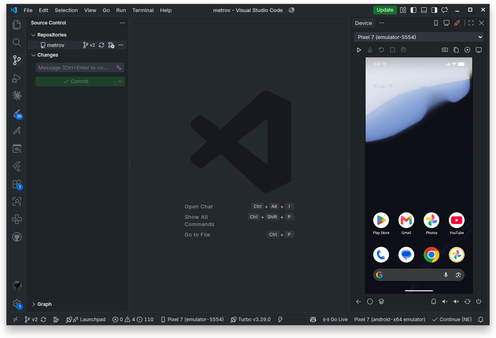

<h1 align="center">Loupe</h1>

<p align="center">
  A close-up of your app, right next to the code.<br>
  Your Android emulator or phone, live in the VS Code side bar, for Flutter and React Native.
</p>

<p align="center">
  <a href="https://github.com/tuzkituan/loupe/releases/latest"></a>
  
  <a href="LICENSE"></a>
</p>

<p align="center">
  
</p>

---

Loupe streams an Android device's screen into VS Code's secondary side bar, over
[scrcpy](https://github.com/Genymobile/scrcpy). You can click and type on it like a real phone, drive hot reload
(Flutter) or Metro (React Native) from the same toolbar, and launch emulators without ever opening a separate
emulator window.

## Features

- **Live mirror.** H.264 at up to 60 fps, decoded in the view with WebCodecs. Low latency, frames never queue up.
- **Real input.** Clicks and drags are finger touches, the wheel scrolls, and the keyboard types into the device,
  including IME input and Ctrl shortcuts.
- **Flutter and React Native controls.** Run on the mirrored device, reload, and open DevTools, with buttons
  picked for the project you have open. See [Frameworks](#frameworks).
- **Device buttons.** Back, home, recents, notifications, volume, rotate and power.
- **Emulators managed for you.** Launch or cold boot any AVD from the view. It runs headless, with the side bar as
  its screen, and shuts down when the VS Code window closes.
- **Capture.** Save a screenshot, copy one to the clipboard, or record the screen to MP4.
- **Works with phones too.** Anything `adb devices` lists, over USB or Wi-Fi.
- **Stays out of the way.** It opens by itself for Flutter and React Native projects and gives the keyboard back to your editor.

## Requirements

| | |
| --- | --- |
| **VS Code** | 1.106 or newer (the first release that allows views in the secondary side bar) |
| **scrcpy** | Any 3.x install: `sudo apt install scrcpy`, `brew install scrcpy`, or the [Windows release](https://github.com/Genymobile/scrcpy/releases). Only its `scrcpy-server` file is used. |
| **Android SDK** | platform-tools, plus the emulator package for AVDs. Android Studio installs both. |
| **Flutter** | The Dart & Flutter extensions (Dart-Code), for the Flutter buttons. |
| **React Native** | Node.js and the project's own CLI (`react-native` or `expo`), for the React Native buttons. |

## Installation

### From a release (recommended)

1. Download the `.vsix` from the [latest release](https://github.com/tuzkituan/loupe/releases/latest).
2. Install it:

   ```bash
   code --install-extension loupe-0.2.0.vsix
   ```

   Or, in VS Code, open **Extensions** (`Ctrl+Shift+X`), then `…` → **Install from VSIX…** and pick the file.
3. Reload VS Code.

### From source

Requires Node.js 20 or newer.

```bash
git clone https://github.com/tuzkituan/loupe.git
cd loupe
npm install
npm run package
code --install-extension loupe-*.vsix
```

To uninstall, run `code --uninstall-extension tuzkituan.loupe`, or remove it from the Extensions view.

## Usage

Open a Flutter or React Native project and **Loupe** appears in the right-hand side bar. With a device connected it starts
mirroring straight away. With nothing connected it lists your AVDs, with **Launch** and **Cold boot** buttons.

You can also open the view yourself:
- `Ctrl+Alt+B` (`Cmd+Alt+B` on macOS)
- the side-bar toggle at the top right of the window
- **Loupe: Focus on Device View** in the Command Palette

The view can be dragged to the left side bar or the panel like any other view. If it ends up somewhere unexpected,
**View: Reset View Locations** puts it back.

### On the screen

| Input | Does |
| --- | --- |
| Click, drag | Tap, swipe (as a finger, so Flutter scrollables respond) |
| Mouse wheel | Scroll |
| Right-click | Back |
| Middle-click | Home |
| Typing | Text into the focused field. Enter, Backspace, arrows, Tab and Ctrl shortcuts are sent as keys. |

### Toolbar

| Row | Buttons |
| --- | --- |
| Top | The [framework buttons](#frameworks), then Screenshot · Copy screenshot · Record · Emulators |
| Bottom | Back · Home · Recents, then Notifications · Volume down · Volume up · Rotate · Power |

### Frameworks

Loupe looks at the open workspace and shows the matching run-loop buttons: a `pubspec.yaml` that depends on the
Flutter SDK means Flutter, and a `package.json` with `react-native` means React Native. If a folder has both, Flutter
wins; set `loupe.framework` to choose yourself. With neither, the buttons are hidden and the mirror works as usual.

| | Flutter | React Native |
| --- | --- | --- |
| **Run** | Starts a Dart-Code debug session on the mirrored device, reusing your first `launch.json` configuration | Expo: `npx expo run:android --device <serial>`. CLI: starts Metro if needed, then `npx react-native run-android --device <serial> --no-packager`. Both run in VS Code terminals. |
| **Reload** | Hot reload | Reloads the JS bundle through Metro |
| **Restart / Dev menu** | Hot restart | Opens the in-app dev menu |
| **Stop** | Stops the debug session | Stops the Metro or Expo server that Loupe started |
| **DevTools** | Flutter DevTools | React Native DevTools (React Native 0.73+) |
| **Enabled when** | A Dart/Flutter debug session is running | Metro answers on `loupe.metroPort` (8081 by default) |

Notes for React Native:
- Reload and the dev menu use Metro's message socket, the same broadcast the Metro terminal sends for its `r` and
  `d` keys. If Metro can't be reached, Loupe sends the equivalent key events to the device instead.
- When the mirror attaches, Loupe runs `adb reverse tcp:<port> tcp:<port>`, so a USB phone can reach Metro on your
  machine.
- Metro started in your own terminal is detected and used. Loupe only stops a server that it started itself.

### Emulators

An emulator launched from the view belongs to that VS Code window. It has no window of its own, and it shuts down
cleanly when the VS Code window closes, saving its quick-boot snapshot so the next launch takes seconds. Emulators
started anywhere else (Android Studio, a terminal, `flutter emulators --launch`) are mirrored but never stopped.

Two consequences:
- **Developer: Reload Window** also stops an emulator launched from that window.
- With several VS Code windows open, an emulator belongs to the window that launched it.

### Commands

All commands are under **Loupe** in the Command Palette:
- Select Device
- Start or Stop an Emulator
- Reconnect Mirror
- Save Screenshot
- Copy Screenshot to Clipboard
- Start or Stop Screen Recording
- Run App on Mirrored Device

## Settings

| Setting | Default | Description |
| --- | --- | --- |
| `loupe.autoOpen` | `true` | Open the Device view when a Flutter or React Native project opens. |
| `loupe.framework` | `auto` | Which run-loop buttons to show: `auto`, `flutter` or `reactNative`. |
| `loupe.metroPort` | `8081` | Port of the Metro (or Expo) dev server. |
| `loupe.sdkPath` | *auto* | Android SDK folder. Falls back to `ANDROID_HOME`, then `ANDROID_SDK_ROOT`, then the Android Studio default location. |
| `loupe.adbPath` | *auto* | adb executable. Defaults to the SDK's own copy, so it matches the adb Flutter uses. |
| `loupe.scrcpyServerPath` | *auto* | The `scrcpy-server` file, when scrcpy is installed somewhere unusual. |
| `loupe.scrcpyVersion` | *auto* | Exact version of that file. Read from `scrcpy --version` when empty. |
| `loupe.maxSize` | `1280` | Longest side of the video in pixels; `0` for full resolution. |
| `loupe.maxFps` | `60` | Frame-rate cap. |
| `loupe.bitRate` | `8000000` | Video bit rate, in bits per second. |
| `loupe.captureFolder` | `.screenshots` | Where screenshots and recordings go, relative to the workspace. |

## Troubleshooting

- **"scrcpy-server was not found".** Install scrcpy, or point `loupe.scrcpyServerPath` at the file.
- **Stuck on "Connecting…".** Run **Reconnect Mirror**. The *Loupe* output channel logs every adb, scrcpy and
  Metro step.
- **A phone shows as "unauthorized".** Unlock it and accept the USB debugging prompt.
- **No emulators listed.** Create one in Android Studio → Device Manager, or set `loupe.sdkPath`.
- **React Native buttons stay greyed out.** Metro isn't answering on `loupe.metroPort`. Start it (or press Run),
  or set the port if you use a custom one.
- **adb keeps restarting.** Two different adb versions are fighting each other. Leave `adbPath` empty, so the
  SDK's copy is used, the same one Flutter uses.

## How it works

```
webview (canvas + toolbar)  ◄── postMessage ──►  extension host  ◄── adb forward ──►  scrcpy-server
  WebCodecs VideoDecoder                           ScrcpySession                        on the device
  pointer / key → messages                         control serializers
```

- **Video.** `src/scrcpy/stream.ts` parses the scrcpy video socket (device name, codec header, then 12-byte frame
  headers) and merges SPS/PPS config packets into the next key frame.
- **Input.** `src/scrcpy/control.ts` serializes touch, scroll, key, text, rotate and reset-video messages in the
  scrcpy 3.x wire format.
- **Falling behind.** If the view can't keep up, or was hidden, the host asks the encoder for a fresh key frame. It
  never feeds the decoder a broken chain of frames.
- **Frameworks.** `src/frameworks/` has one adapter per framework (Dart-Code debug sessions for Flutter; Metro's
  HTTP endpoints and message socket for React Native), chosen by `src/projectDetect.ts`.
- **Emulators.** `src/emulator.ts` launches AVDs headless and records the ones it owns, so they can be shut down
  with the window, or re-adopted after a crash.

## Development

```bash
npm install
npm run build        # dist/extension.js + dist/webview.js
npm run watch        # rebuild on change
npm run typecheck
npm test             # protocol, detection and Metro helpers (vitest)
npm run package      # produces the .vsix
```

Press **F5** to open an Extension Development Host with the extension loaded.

## License

[MIT](LICENSE) © Tuan Nguyen
